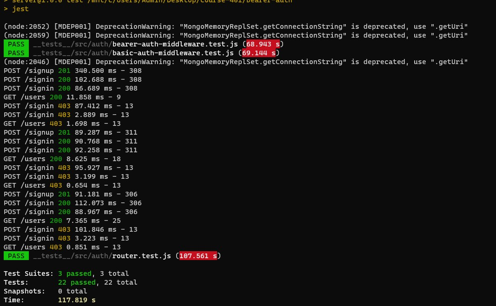
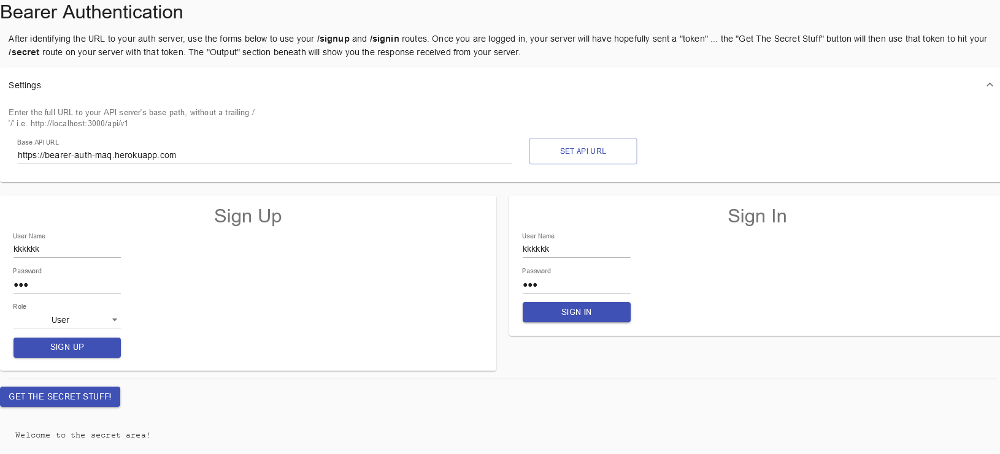
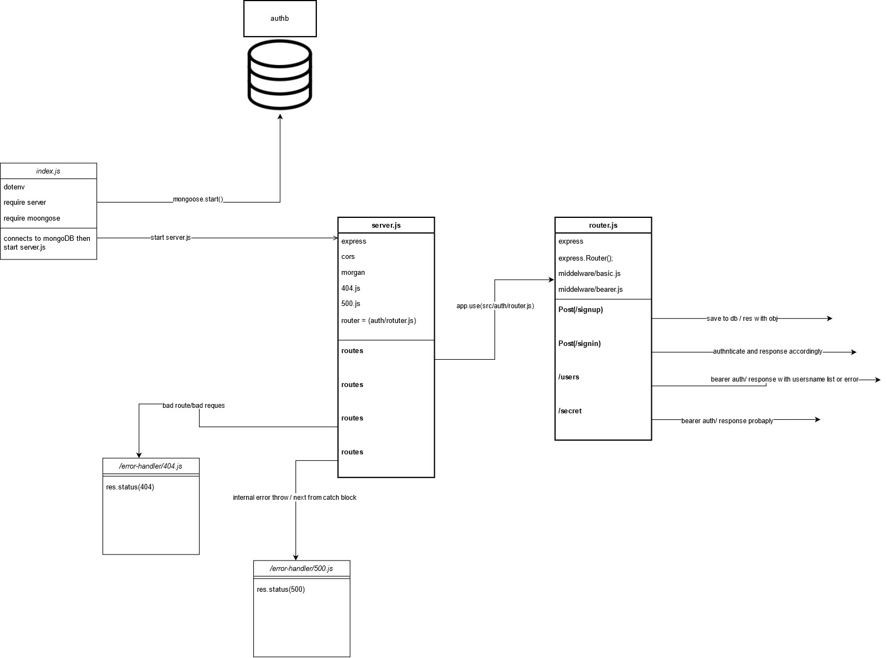

# bearer-auth

## Deployment Test





### Author: Mohammad Quthama

- [submission PR](https://github.com/mohammad-qethama/bearer-auth/pull/1)
- [tests report](https://github.com/mohammad-qethama/bearer-auth/actions)
- [master-deployment](https://bearer-auth-maq.herokuapp.com/)

### Setup

#### `.env` requirements

- `PORT` - 3000
- `MONGOOSE_URI` - `mongodb+srv://<username>:<password>@cluster0.pyufn.mongodb.net/auth`
- `SECRET`  - 'randomly-generated number `extra encryption layer`'

#### Dependencies

- mongoose.
- cors.
- express.
- jasonwebtoken(jwt)
- dotenv
- bcrypt
- base-64
- morgan

#### Devdependencies

- eslint
- jest
- @codefellows/supergoose

#### Running the app

- `npm start`

- Endpoint: `/signin`
  - Returns status(201)
  - returns json file with user data in it
  - Post method

```JavaScript

authRouter.post('/signin', basicAuth, (req, res, next) => {
  const user = {
    user: req.user,
    token: req.user.token
  };
  res.status(200).json(user);
});


```

- Endpoint: `/signup`
  - Returns status(201)
  - returns json file with the content of the DB table `clothes`
  - Post method

```JavaScript

authRouter.post('/signup', async (req, res, next) => {
  try {
    let user = new User(req.body);
    const userRecord = await user.save();
    const output = {
      user: userRecord,
      token: userRecord.token
    };
    res.status(201).json(output);
  } catch (e) {
    next(e.message)
  }
});

```

#### Tests

- Unit Tests: `npm run test`
  - test for routing `router.test.js`
  - test for middleware:
    - `basic-auth-middleware.test.js`
    - `bearer-auth-middleware.test.js`
  
#### UML


